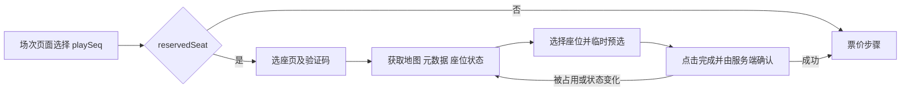

# OneStop 场次与选座流程：公开静态代码观察

核对日期：2026-10-08，Asia/Shanghai。研究对象是实际页面已加载的官方静态资源，构建目录为 `onestop-v2-front/00e9c0`。本次源码研究只做匿名 GET，未携带 Cookie、用户 token 或排队 key；没有请求下述业务接口。真实浏览器已正常到达选座验证码，过程另见 [实际页面记录](selection-and-hold.md#已进入正式选场与选座页)。

## 正常页面流程

`/onestop/schedule` 是 Next.js Pages Router 页面，脚本导出 `__N_SSP=true`。选好场次后，前端把所选场次写入 sessionStorage 中的 `interpark/context.playSeq`，刷新上下文；商品 `reservedSeat` 为真时 `router.push("/seat")`，否则直接进入 `router.push("/seat?step=price")`。实际页面路径包含 `/onestop` 基址。[schedule 官方脚本](https://ent-web-assets.interparkcdn.net/applications/onestop-v2-front/00e9c0/_next/static/chunks/pages/schedule-5d9a9a5f0f42a76d.js)

选座页面把地图、座位元数据、实时状态和已选座位分开处理。原生预选通过 GraphQL mutation 完成；“选座完成”再调用 REST 确认接口，成功后才进入 `/seat?step=price`。在前端选中、服务器临时预选、服务器确认三个阶段，状态可能不同；点击图上的座位不意味着已经获得最终预约。[seat 官方脚本](https://ent-web-assets.interparkcdn.net/applications/onestop-v2-front/00e9c0/_next/static/chunks/pages/seat-3ef3a6d93eac95d4.js)、[官方 API 助手 chunk，module 50983](https://ent-web-assets.interparkcdn.net/applications/onestop-v2-front/00e9c0/_next/static/chunks/9732-c3fe521600354fda.js)

## 源码可确认的通信边界

以下是静态代码声明，并非本次实测的接口响应或可独立使用的操作说明。接口客户端会使用当前预约上下文、Cookie 和 session 等信息。

| 阶段 | 源码声明的方法或路径 | 观察 |
|---|---|---|
| 初始化 | GraphQL `InitSeat`，POST `/onestop/gql` | 返回 `ticketMaxCount`、`isInterlocking` |
| 区域与票档 | GET `/onestop/api/seats/block-data`、`/onestop/api/seats/grades` | 依据商品、场馆、场次获取 |
| 座位元数据 | GET `/onestop/api/seatMeta`；联动商品 `/onestop/api/externalSeatMeta` | 按 `blockKeys` 分块获取 |
| 座位状态 | GET `/onestop/api/seatStatus`；联动商品 `/onestop/api/externalSeatStatus` | 返回状态及 `last-seat-modified` 响应头 |
| 临时预选 | GraphQL `PreselectSeat`、`BulkPreselectSeats` | 使用当前场次、区块、票档和座位标识 |
| 取消临时预选 | GraphQL `DeselectSeat`、`BulkDeselectSeats` | 取消后更新本地选中状态 |
| 确认已选座位 | POST `/onestop/api/seats/select`；联动商品 `/onestop/api/seats/select-external` | 成功后进入票价步骤 |
| 验证码 | POST `/onestop/api/captcha/image`、GET `/onestop/api/captcha/verify` | 正常页面由用户输入验证码，结果为 `Y` 才继续 |

这些方法集中在 [9732 官方 chunk](https://ent-web-assets.interparkcdn.net/applications/onestop-v2-front/00e9c0/_next/static/chunks/9732-c3fe521600354fda.js) 的 module 50983；GraphQL 客户端 module 48037 为 POST `/gql` 设置 `operationName`、query 与 variables。REST 客户端在 [_app 官方脚本](https://ent-web-assets.interparkcdn.net/applications/onestop-v2-front/00e9c0/_next/static/chunks/pages/_app-2a5e0274a339ea28.js) 的 module 64958 中，带 `withCredentials=true`，从 `interpark/context` 读取 `X-Onestop-Channel`、`X-Onestop-Session` 等上下文头；GraphQL 客户端还按商品的预约上下文附加授权信息。静态代码中的接口名不能证明匿名或跨会话可用。

座位状态有缓存及刷新逻辑。已下载的地图 chunk 包含按区块合并元数据、十六进制状态解码、状态变更时间与旧响应过滤；兼容回退路径的 SWR 刷新间隔为随机约 3–4 秒，且在预览、会话到期等条件下停止。另有读取已填充 `viewBlocks/viewMeta/viewStatus` 缓存的路径，因此不能把该回退间隔断言为所有页面的统一刷新周期，也没有证据支持“全部通过 WebSocket 推送”。[7239 官方地图 chunk](https://ent-web-assets.interparkcdn.net/applications/onestop-v2-front/00e9c0/_next/static/chunks/7239-7759d924aaf45a70.js)

## 临时预选、过期和错误

前端首次预选时设置 `preReserveExpireTime = Date.now() + 420000`；确认选座成功后设置 `reserveExpireTime = Date.now() + 420000`，即两个阶段的前端计时常量均为 7 分钟。预选计时剩余不超过 120 秒时弹提醒，到 0 时调用重置已选座位；清空选择也会删除本地计时。这个数值是当前构建的前端行为，未验证服务端真实锁定期限。[seat 脚本](https://ent-web-assets.interparkcdn.net/applications/onestop-v2-front/00e9c0/_next/static/chunks/pages/seat-3ef3a6d93eac95d4.js)、[_app 常量 module 56343](https://ent-web-assets.interparkcdn.net/applications/onestop-v2-front/00e9c0/_next/static/chunks/pages/_app-2a5e0274a339ea28.js)、[计时读取 module 64029](https://ent-web-assets.interparkcdn.net/applications/onestop-v2-front/00e9c0/_next/static/chunks/5171-e24a2e7ebae667ed.js)

前端显式区分座位已占用、已被临时预选、状态变化、临时预选确认无效、连座组数量不符、未开售、异常访问、长时间无操作及会话过期。确认失败可依据服务端 `unselectableSeatInfoIds` 移除不可选座位、刷新受影响区块或显示错误；未开售会转错误页。异常访问和长时间无操作显示会话失效提示，确认后回商品页。[错误码 module 6285](https://ent-web-assets.interparkcdn.net/applications/onestop-v2-front/00e9c0/_next/static/chunks/3995-006769ae8fc6e02e.js)、[seat 错误处理](https://ent-web-assets.interparkcdn.net/applications/onestop-v2-front/00e9c0/_next/static/chunks/pages/seat-3ef3a6d93eac95d4.js)

验证码组件正常生成图像，要求 6 位字母，转换为大写；图片生成超过 5 分钟时提示重新生成。成功结果会记录一个本地验证标记。该标记是前端 UI 状态，不能据此认为后端验证可被跳过。[7239 验证码组件](https://ent-web-assets.interparkcdn.net/applications/onestop-v2-front/00e9c0/_next/static/chunks/7239-7759d924aaf45a70.js)

## 已观察到的 SVG

两个 SVG 均为 `699×596`，内容为 rect/circle/path/mask/g 等图形，没有 script 节点，也没有座位标识或状态字段。它们能证明静态场馆底图的来源，不能据此判断余票或持有状态。

- [底图一](https://ent-ticketimage.interparkcdn.net/svg/26001167/ea91e9b960c8466bad10fea7bf8a44af.svg)：159 个 path。
- [底图二](https://ent-ticketimage.interparkcdn.net/svg/26001167/087dd34c78914d7c972c56fc356b0e3b.svg)：97 个 path。

## 证据与限制

本机研究目录保留官方静态文件、下载记录和短代码证据，不打包浏览器会话或原始业务数据。公开脚本与 SVG 的准确地址已在本文引用。

研究没有检查用户实际预约上下文，也没有确认具体座位、库存、服务端锁定成功、支付或订单状态。公开代码能解释正常流程和请求类型，不能提供有效会话、排队资格或保证预约成功。
